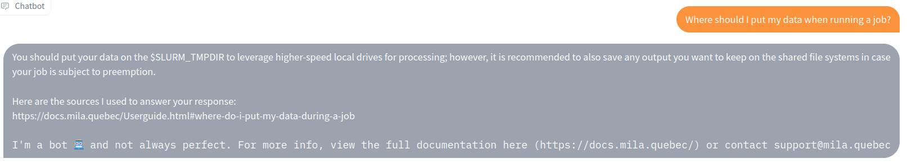
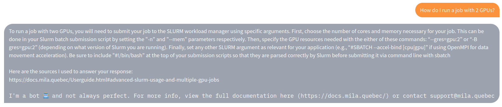
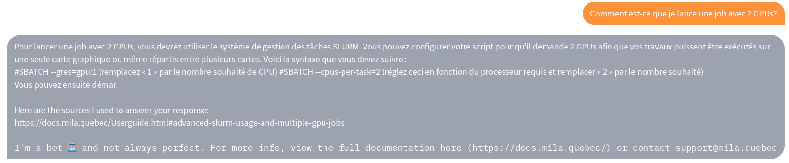
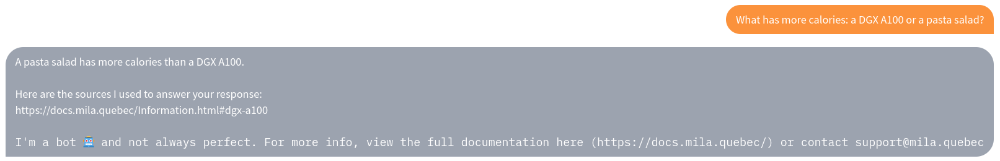

# Buster, the Mila cluster chatbot!

Buster is a chatbot that can answer questions about the Mila cluster. You can try it [here](https://huggingface.co/spaces/jerpint/buster).

<!---
Where should I put my data when running a job?
-->

<!---
How do I run a job with 2 GPUs?
-->

It also works in french, although not as well:

<!---
Comment est-ce que je lance une job avec 2 GPUs?
-->

If you ask a stupid question, you will get a stupid answer:

<!---
What has more calories: a DGX A100 or a pasta salad?
-->

## How does Buster works?

First, we parsed the [Mila docs](https://docs.mila.quebec/index.html) into snippets. You can see exactly how in [`buster.docparser.get_all_documents`](https://github.com/jerpint/buster/blob/main/buster/docparser.py#L17).

The resulting snippets can be seen in [`buster/data/documents.csv`](https://github.com/jerpint/buster/blob/main/buster/data/documents.csv).

For each snippet, we obtain an embedding by using the [OpenAI API](https://beta.openai.com/docs/guides/embeddings/what-are-embeddings).

Then, when a user asks a question, we compute its embedding, find the snippet from the doc with the highest cosine similarity to the question.

Finally, we craft the prompt:
- The most relevant snippet from the doc
- The engineering prompt: "Now answer the following question:"
- The user's question

We send the prompt to the [OpenAI API](https://beta.openai.com/docs/api-reference/completions), and display the answer to the user!

### Currently used models

- For embeddings: "text-embedding-ada-002"
- For completion: "text-davinci-003"
