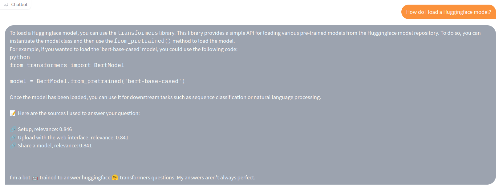

# Buster, the QA documentation chatbot!

Buster is a question-answering chatbot that can be tuned to specific documentations. You can try it [here](https://huggingface.co/spaces/jerpint/buster), where it will answer questions about [🤗 Transformers](https://huggingface.co/docs/transformers/index).

## How does Buster works?

First, we parsed the documentation into snippets. For each snippet, we obtain an embedding by using the [OpenAI API](https://beta.openai.com/docs/guides/embeddings/what-are-embeddings).

Then, when a user asks a question, we compute its embedding, and find the snippets from the doc with the highest cosine similarity to the question.

Finally, we craft the prompt:
- The most relevant snippets from the doc.
- The engineering prompt.
- The user's question.

We send the prompt to the [OpenAI API](https://beta.openai.com/docs/api-reference/completions), and display the answer to the user!

### Currently used models

- For embeddings: "text-embedding-ada-002"
- For completion: "text-davinci-003"
